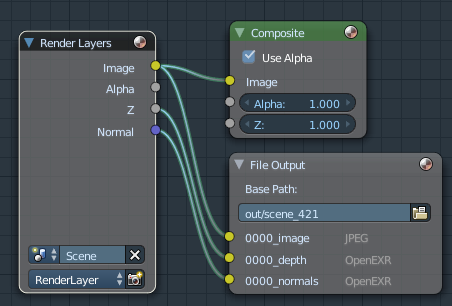
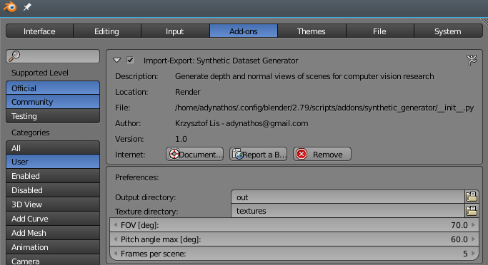
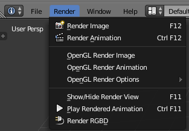
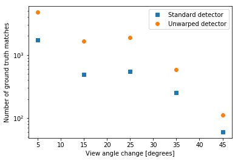
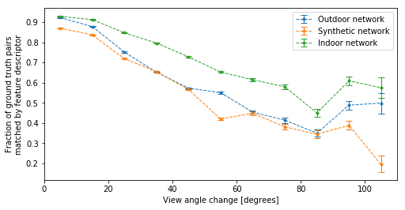

# Design and evaluation of viewpoint invariant feature descriptors using convolutional neural networks - software documentation

*Master thesis, Krzysztof Lis 2017*

This is the code used in my [master thesis](http://liskr.net/pub/MasterThesis-KrzysztofLis.pdf),
in which I compare different ways of achieving viewpoint-invariance in feature descriptors:

- explicitly undoing perspective distortion of planar regions ("unwarping")
- training a feature descriptor neural network specifically for unwarped images
- providing scene geometry information (depth, normals) to a feature descriptor neural network
	in an attempt to directly learn viewpoint invariance

## Overview

The software for this thesis consists of the following parts:

- `src/opencv_mod` - modifications of OpenCV which expose plane-segmentation functions to Python [(link)](#opencv-modifications)
- `src/synthetic` - Blender script which generates a synthetic RGBD dataset [(link)](#synthetic-rgbd-dataset)
- `src/main` - Python code for comparison of feature descriptor methods: [(link)](#descriptor-comparison)
	- [RGBD dataset loading](#loading-rgbd-datasets)
	- [Plane segmentation of a point cloud, orthogonal views of planes](#plane-detection-orthogonal-views-of-planes)
	- [Patch extraction for keypoints](feature-points-patches)
	- [Ground truth keypoint matches using scene geometry and camera poses](#keypoint-projection-ground-truth-matches)
	- [Descriptor matching accuracy with respect to view angle change](#matching-accuracy-measurement)
	- [Extraction of training data for descriptor networks](#training-data-extraction)
	- [Training of descriptor networks](#descriptor-network-training)

Examples of the usage of the software can be seen in the jupyter notebooks:

- `src/main/example.ipynb` ([PDF](./src/main/example.pdf)) - illustration of feature detection, description, matching, evaluation,
- `src/main/evaluation.ipynb` ([PDF](./src/main/evaluation.pdf)) - evaluation script used in the thesis,
- `src/main/eval_plots.ipynb` ([PDF](./src/main/eval_plots.pdf)) - drawing plots for the thesis,
- `src/main/generate.ipynb` ([PDF](./src/main/generate.pdf)) - generate training data.

The directory structure used by the default settings is shown [here](#directory-structure).

---

## Libraries
The software uses the following libraries:

- numpy
- scipy
- matplotlib
- click
- attrdict
- statsmodels
- cyvlfeat [https://github.com/menpo/cyvlfeat](https://github.com/menpo/cyvlfeat)
- PyTorch [http://pytorch.org](http://pytorch.org)
- OpenCV - with [our modifications](#opencv-modifications)

### OpenCV modifications

In order to perform plane segmentation, we use [OpenCV's rgbd module](http://docs.opencv.org/3.3.0/d2/d3a/group__rgbd.html).
However, its functions are not exposed in the Python API.
We add the following functions, accessible from Python:

- **depthTo3d** - convert a depth map to a point cloud:
```c++
	/** Converts a depth image to an organized set of 3d points.
	* The coordinate system is x pointing left, y down and z away from the camera
	* @param depth the depth image (if given as short int CV_U, it is assumed to be the depth in millimeters
	*              (as done with the Microsoft Kinect), otherwise, if given as CV_32F or CV_64F, it is assumed in meters)
	* @param K The calibration matrix
	* @param points3d the resulting 3d points. They are of depth the same as `depth` if it is CV_32F or CV_64F, and the
	*        depth of `K` if `depth` is of depth CV_U
	* @param mask the mask of the points to consider (can be empty)
	*/
	CV_EXPORTS_W
	void
	depthTo3d(InputArray depth, InputArray K, OutputArray points3d, InputArray mask = noArray());
```
- **calculateNormals** - calculate normal vectors from a point cloud:
```c++
	/** Given a set of 3d points in a depth image, compute the normals at each point.
	* @param points a rows x cols x 3 matrix of CV_32F/CV64F or a rows x cols x 1 CV_U16S
	* @param normals a rows x cols x 3 matrix
	* @param K a 3 x 3 matrix of camera intrinsic parameters
	* @param window_size the window size to compute the normals: can only be 1,3,5 or 7
	* @param method one of the methods to use: RGBD_NORMALS_METHOD_SRI, RGBD_NORMALS_METHOD_FALS
	*/
	CV_EXPORTS_W void calculateNormals(InputArray points, OutputArray normals, InputArray K, int window_size = 5, int method = RgbdNormals::RGBD_NORMALS_METHOD_FALS);
```
- **detectPlanes** - segment a point cloud into planar regions:
```c++
	/** Find The planes in a depth image
	* @param points3d the 3d points organized like the depth image: rows x cols with 3 channels
	* @param normals the normals for every point in the depth image
	* @param mask An image where each pixel is labeled with the plane it belongs to
	*        and 255 if it does not belong to any plane
	* @param plane_coefficients the coefficients of the corresponding planes (a,b,c,d) such that ax+by+cz+d=0, norm(a,b,c)=1
	*        and c < 0 (so that the normal points towards the camera)
	* @param plane_coefficients how far a point can be from a plane to belong to it (in meters)
	* @param block_size the size of the blocks to look at for a stable MSE
	* @param sensor_err_a coefficient of the sensor error with respect to the. All 0 by default but you want a=0.0075 for a Kinect
	*/
	CV_EXPORTS_W
	void
	detectPlanes(InputArray points3d, InputArray normals, OutputArray mask, OutputArray plane_coefficients, double distance_threshold = 0.01, int block_size=40, double sensor_err_a=0.0);
```

To use them, we build OpenCV from modified source.
The build procedure is as follows:

- Download [OpenCV 3.2.0](https://github.com/opencv/opencv/releases/tag/3.2.0) source and decompress to `build_dir/opencv`
- Download [OpenCV contrib 3.2.0](https://github.com/opencv/opencv_contrib/releases/tag/3.2.0) source and decompress to `build_dir/opencv-contrib`
- Copy the files from `here/src/opencv_rgbd_mod` to `build_dir/opencv-contrib/modules/rgbd` (some files should be overwritten)
- We will need to build the OpenCV Python module, therefore need Python development headers.
Ensure that the `python3-dev` package is installed (or point `$PATH` to an existing Python installation such as Anaconda).
- Enter `build_dir/build` and run `cmake`, specifying the location of the extra modules:
```
cmake -DOPENCV_EXTRA_MODULES_PATH=<opencv_contrib>/modules <opencv_source_directory>
```
- The detected settings can be now investigated with CMake GUI - for example to check if Python was properly detected.
- Build and install:
```
cmake -j8
sudo make install
```

---

## Synthetic RGBD dataset

The synthetic RGBD dataset is generated using Blender.
The generator software consists of a Blender scene and an addon script that loads the textures and moves the camera.
RGBD output is produced using a Compositing graph:



To generate a synthetic dataset:

- Install the addon:
copy or symlink the addon's directory `src/synthetic/synthetic_generator`
to 
`~/.config/blender/2.78/scripts/addons/synthetic_generator`
- Open the file `src/synthetic/SyntheticRGBD_gen.blend`
- Navigate to: `File -> User Preferences -> Add-Ons`
- Choose the category `User`
- Enable the addon `Import-Export: Synthetic Dataset Generator`
- Edit the settings:
	- *Texture directory*: a directory containing images to be put on the plane
	- *Frames per scene*: number of frames to generate for a given texture, the first frame is always a frontal view
	- *Pitch angle max*: maximal angle between the camera ray and the *Z*-axis
	
	

- To start generating, click `Render -> Render RGBD`
	
	
- The generated files are placed in the `Output directory`:
	For each texture, a `scene_###` directory is created (`###` - texture number).
	The frame with number *ffff* is represented by the following files:
	- `ffff_pose.csv` - camera pose as a 4x4 transformation matrix
	- `ffff_image0032.jpg` - RGB image
	- `ffff_depth0032.exr` - depth map (as `EXR`, an image format allowing floating point values)
	- `ffff_normals0032.exr` - surface normal map

---

## Descriptor comparison

The following mechanisms are shown in practice in `src/main/example.ipynb` ([PDF](./src/main/example.pdf)).

### Loading RGBD Datasets

File `datasets.py`

The class `Dataset` represents a set of images taken in a given scene.
The algorithm works on sub-sequences extracted from those datasets.

`FrameSequence` represents a sequence of frames extracted from a dataset.

`RgbdFrame` is a single frame with the following information:

- `frame.photo` - RGB photo
- `frame.photo_gray_float` - grayscale photo, converted to float32
- `frame.depth` - depth map, preprocessed with a median filter, missing values denoted by NaN
- `frame.intrinsic_mat` - the intrinsic parameter matrix *K*
- `frame.world_to_camera` - camera pose, in the form of a 4x4 spatial transformation matrix (using homogenous coordinates)
- `frame.camera_to_world` - camera pose, inverted

Example:

```python
	# Select a dataset:
	dset = DatasetColmap(attrdict.AttrDict(
		dir_datasets = '/path/to/datasets',
	))

	# Extract a sequence
	data = dset.get_sequence(
		index_of_first_frame,
		number_of_frames, 
		stride, # offset between consecutive frames
	)

	# A frame's photo
	data.frames[0].photo
```

We can load the following datasets:

- `Dataset7Scenes` - [7 Scenes](https://www.microsoft.com/en-us/research/project/rgb-d-dataset-7-scenes/),
- `DatasetFreiburg` - [TUM's "Freiburg"](http://vision.in.tum.de/data/datasets/rgbd-dataset/download),
- `DatasetColmap` - [COLMAP](https://colmap.github.io/) SfM reconstructions,
- `DatasetSyntheticGen` - our synthetic dataset.

### Plane detection, orthogonal views of planes

File `planes.py`.

Segmentation is done by the function `seq_detect_planes(frame_sequence, b_normals=True)`.
It extends each processed frame with the additional information:

- `frame.point_cloud` - a HxWx3 array. `frame.point_cloud[row, col, :]` is the 3D point corresponding to the pixel at `(row, col)`.
- `frame.normals` - HxWx3 array, `frame.normals[row, col, :]` is the surface normal vector corresponding to the pixel at `(row, col)`.
- `frame.plane_map` - for each pixels, it determined to which plane the pixel belongs to.
	Equal to `0` if the pixel belongs to no plane, or `plane_id+1` if the pixel belongs to plane `frame.planes[plane_id]`.
- `frame.planes` - list of `PlaneRegion` objects representing planes detected in the image.

Each `PlaneRegion` object contains:

- `plane.coefficients` - array `[a, b, c, d]` such that the plane is defined as `ax+by+cz+d=0`
- `plane.hull` - vertices of a convex hull around the region in input image, Nx2 array
- `plane.area` - region area relative to the surface of the whole input image

The function `plane_unwarp(plane_obj)` will calculate the orthogonal view of the plane.
The additional information will be stored in the plane object:

- `plane.homography` - homography used to unwarp the plane
- `plane.unwarped_img` - orthogonal view of the plane (grayscale)

If the argument `b_demo=True` is passed, the function will return a color image of the unwarped plane, with the convex hull marked.

### Feature points, patches

File: `patches.py`, `detectors.py`

We will use two detectors: SIFT on original images and SIFT on unwarped planes.
Since a frame object can only hold one set of keypoints, 
we make a copy of the sequence (after plane detection), to accomodate these two sets of keypoints.
```python

	data_ubd = seq_clone(data)
```

Now we can proceed to detect the feature points and extract patches.
Detection, patch extraction is done with a single function.
SIFT descriptors are also calculated in this step, as it is convenient to do detection and description with a single library call.

- SIFT on original images:
```python
	seq_detect_sift_flat(data)
```
- Use the same keypoints from the step above, but extract patches from unwarped planes  (*unwarp-after-detection* in the thesis)
```python
parallel_process(frame_describe_unwarp, data.frames)
```
- SIFT on unwarped planes: (*unwarp-before-detection* in the thesis)
```python
	seq_detect_sift_unwarp(data_ubd)
```

The process extracts patches from feature points, resizes them to 32x32 and stores in `frame.patch_lists`.
There are 3 types of patches:

- Original patches: `seq.frames[0].patch_lists['flat']`
- Unwarp-after-detection patches: `seq.frames[0].patch_lists['flat']`
- Unwarp-before-detection patches: `seq_ubd.frames[0].patch_lists['unwarp_det']`

A `PatchList` object (obtained from `frame.patch_lists[patch type]`) contains:

- `patch_list.patches` - list of patches (list of 32x32 arrays)
- `patch_list.patch_array` - patches as a single array of shape Nx32x32

The patches extracted from the original images also contain depth and surface normal channels:

- `patch_list.depth_array` - depth patches, shape Nx32x32
- `patch_list.normal_array` - surface normal patches, shape Nx32x32x3

### Keypoint projection, ground truth matches

File `keypoint_projection.py`

The algorithm described in Section *4.4.1 Transforming feature points*
is used to transform feature points (center, scale, orientation)
with a homography (to project features onto unwarped planes)
or with a spatial transform between frames (to find ground truth matches using scene geometry).

Transformation under homography is performed by the function `homography_apply_to_keypoints`:
```python
	homography_apply_to_keypoints(
		H, # homography matrix
		pt_locs, # feature centers, Nx2
		pt_sizes, # feature scales, Nx1
		pt_orientations, # feature orientation Nx1
	)
```
which returns `centers, scales, orientations` in the same format.

Ground truth feature matching using geometry, as described in Section *6.1 Ground truth matches*,
is performed by the function `keypoints_match_geometry(src_frame, dest_frame)`.
Points from `src_frame` are projected onto `dest_frame`, matches are established
if the differences in location, scale and orientation are below selected thresholds.
Pairs of nearby points in 2D are found using a [kd-tree](https://docs.scipy.org/doc/scipy/reference/generated/scipy.spatial.cKDTree.html).
The function `keypoints_match_geometry` returns:
```python
	return AttrDict(
		# matches as Nx2 array
		# row: [a, b] means that point a from src_frame matches with point b from dest_frame
		pairs = match_pairs,
		# values of view angle change, Nx1 array
		# angles[k] = view angle change for pair pairs[k, :]
		angles = view_angle_changes,
	)
```
To match all frames of a sequence to the first frame, use `seq_find_groundtruth_matches_to_first_frame(sequence)`.

The keypoint projection algorithm can be used in general in this way:
```python
	helper_points = kptproj_prepare_vectors(pt_locs, pt_sizes, pt_orientations)

	# helper_points - an array of points, Nx2
	# now apply the transformation to them
	helper_points_2 = transform(helper_points)

	# obtain transformed features
	pt_locs_2, pt_sizes_2, pt_orientations_2 = kptproj_interpret_projected_vectors(helper_points_2)
```

### Descriptors

File: `descriptor_tfeat.py`

The SIFT descriptors are calculated at the time when patches are extracted.
In order to use the descriptor network, we first create the network and load the weights:
```python
	tfeat_7sc_flat = TFeatRunner(
		name='net_7sc_int', # name of descriptor, used as dictionary key 
		model_file=pp(DIR_OUT_MODELS, '7sc_flat_int', 'weights_020.hdf5'), # path to file containing weights
		net_type=PatchMode.INTENSITY, # type of input, INTENSITY / DEPTH / NORMALS
	)
```
The method `tfeat_7sc_flat.describe_patch_list` takes a `PathList` object and calculates descriptors for the extracted patches.
To calculate descriptors for all patch lists, we iterate over them:
```python
	parallel_process(
		tfeat_7sc_flat.describe_patch_list,
		get_patch_lists(data.frames, ['flat', 'unwarp']) + get_patch_lists(data_ubd.frames, ['unwarp_det']),
		threading=False,
		disp_progress=True,
	)
```

The descriptors are stored in `frame.descriptions[(patch type, descriptor name)]`.
For example:
```python
	frame.descriptions[('flat', 'sift')].descriptors # N x 128 array of descriptor vectors
	frame.descriptions[('flat', 'net_7sc_int')].descriptors
```

### Matching, accuracy measurement

File `matching.py`

Descriptor matching and comparison between descriptor and ground-truth matches is done in the function
`match_frame_pair(src_frame, dest_frame)`
which returns a dictionary containing the following keys:

- *gt_pairs* - Nx2 array, a row `[a, b]` signifies that point `a` from `src_frame` and point `b` from `dest_frame` match according to scene geometry
- *gt_angles* - view angle changes for the above matches
- *descr_redetects* - indices of rows in *gt_pairs* which were re-detected with descriptors.
	Since the frames can have multiple types of descriptors, this is a dictionary where the key is `(patch type, descriptor type)`.
```python
	print('Ground truth matches:', 
		measurements[0]['gt_pairs'][:10, :], '...',
	)
	# [  57   17]
	# [  59    1]
	# [  60    2]
	# [  61 1784]
	# ...

	print('Redetected using descriptors:', 
		measurements[0]['descr_redetects'][('flat', 'sift')][:10], '...',
	)
	# [ 1  4  5  6  7 ....
```

The results of matching multiple pairs of frames are accumulated in a `AccuracyAccumulator` object.
By default the match counts are binned in bins of 1 degree of angle change.
```python
	# Match the sequences to their first frames:
	measurements = POOL.map(
		lambda fr: match_frame_pair(data.frames[0], fr),
		data.frames[1:],
	)
	measurements_ubd = POOL.map(
		lambda fr: match_frame_pair(data_ubd.frames[0], fr),
		data_ubd.frames[1:],
	)

	# combine the measurements:
	acc = AccuracyAccumulator()
	for m in measurements + measurements_ubd:
		acc_add_measurements(acc, m)
```
The `AccuracyAccumulator` can:

- Plot the number of ground truth matches with respect to view angle change and detector used:
```python
	plot_acc_gt(acc)
```

	

- Plot the accuracies:
```python
	plot_acc(
		# Accuracy Accumulator
		acc,  
		# merge this number of bins (by default 1 bin = 1 degree) for each point in plot
		shard = 10, 
		# mapping from (patch type, descriptor name) to the name displayed in legend
		desc_ids = [
			('flat', 'net_arch_int', 'Outdoor network'),
			('flat', 'net_syn_int', 'Synthetic network'),
			('flat', 'net_7sc_int', 'Indoor network'),
		],
		# save plot to this file:
		save=pp(DIR_OUT_FIGURES, 'dset_comp', 'dset_accuracy_esyn.pdf'),
	) 
```

	The plots used in the report are shown in `eval_plots.ipynb` (rendered to `eval_plots.pdf`).

	

- Be persisted in files:
```
acc_save(acc, file_path)
acc = acc_load(file_path)
```
- Merged:
```
acc_merge(acc_1, acc_2)
```

**Sliding window evaluation**

Files `matching.py`, `evaluation.ipynb` (`evaluation.pdf`)

In the evaluation phase, we measure on a big number of frame pairs.
We assume that the camera is moving and therefore only frames close enough in the dataset can depict common areas.
For a given scene, we move a sliding window along the frames.
The next frame to add to the window is selected by jumping by a random number (in selected range)
to vary the angle change.
A new frame is matched against all currently in the window, then its added to the window. The oldest frame is removed.

The evaluation is executed in `evaluation.ipynb` (`evaluation.pdf`).
```python
	evaluation_global(
		# list of Dataset objects
		dsets_arch_test,
		# output directory for evaluation results
		pp(DIR_OUT_EVAL, 'eval_arch_all_long'),
		# function which calculates descriptors for a given frame
		describe_all,
		# next frame is chosen by jumping by a random stride
		# the random stride is selected from this range
		(1, 3),
		# size of sliding window
		win_size=5,
		multiproc=False,
		multidet=True,
	)
```

### Training data extraction

File: `generation.py`, `generate.ipynb` (`generate.pdf`)

We prepare the data for network training in the following steps:
- Extract sequences from the datasets.
- Find geometry-based matches to the first frame of each sequence.
- Extract patch tracks (filter out too short ones)
- Saving patch tracks to `hdf5` files.

A separate output file is created for each type of patches.

```python
	gen_patches_main(
		# scenes from which to extract
		dsets_synth_train[:50], 
		DIR_OUT_SYNTH, # output dir
		# types of patches (each creates a separate sub-dir)
		plist_ids = ['flat', 'unwarp', 'unwarp_det'],
		# filter keypoint tracks that have at least this many frames
		min_track_length = 3, 
		seq_per_dset = 1, # number of sequences per scene
		frames_per_seq = 16, # number of frames per sequence
		stride = 1, # stride in images
		proc_count = 4, # number of multiprocessing processes
	)
```

### Descriptor network training

File: `tfeat_training.py`

The descriptor network is trained using the `tfeat_training.py` executable script,
which accepts the following arguments:

- `--net_type` - number of input channels: `intensity`, `depth`, `normals`
- `--out_dir` - where to write weigts
- `--dataset_dir` - directory containing the `hdf5` files with patch tracks
- `--batch_size` - triplets per batch
- `--epoch_size` - number of triplets per epoch
- `--epochs` - number of epochs (default 20)

The arguments used to train the networks used in the thesis are written in the `train_*.sh` files, for example:
```bash
python3 tfeat_training.py \
	--net_type "depth" \
	--out_dir "../../out/models/7sc_depth" \
	--dataset_dir "../../datasets/generated/7sc/flat" \
	--batch_size 256 \
	--epoch_size 1280000 \
```

The weights are saved after each epoch as `weights_###.hdf5`, `###` = epoch number.

---

## Directory structure

```
here
	src
		main
		opencv_mod
		synthetic

	datasets
		architectural
			south-building-sml
				cameras
					cameras.txt
					...
				depth_maps
					P1180141.JPG.photometric.bin
					P1180142.JPG.photometric.bin
					...
				images
					P1180141.JPG
					...

			graham-hall-exterior-sml
			person-hall-sml
			gerrard-hall-sml

		7scenes
			redkitchen
				seq-01

			pumpkin
			...

		synthetic
			scene_000
			scene_001
			...

		generated
			arch
				flat
					graham-hall-exterior_.hdf5
					...
				unwarp_both
					graham-hall-exterior_.hdf5
					...
			7sc
			synthetic

	out
		models
			arch_flat_int
				weights_020.hdf5
			...
		eval
		figures
```
